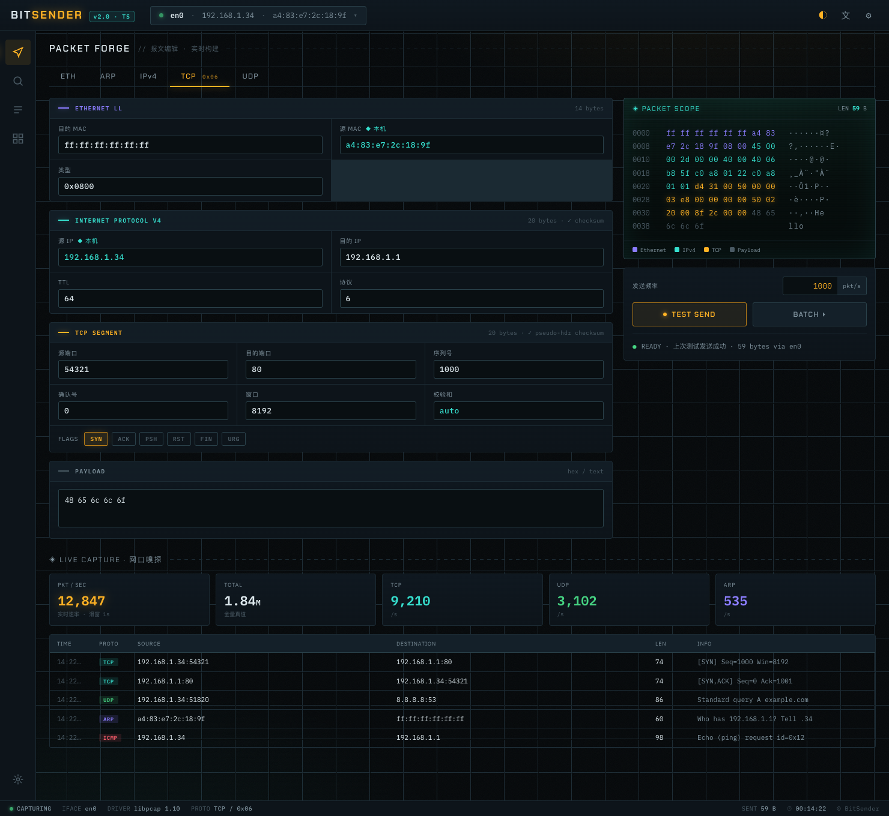

<div align="center">

# BitSender

**Cross-platform network packet crafting, sending, and capturing. One native GUI.**

Build raw L2 frames field by field, fire them at line rate, and sniff the wire back, all from a fast desktop app. Rust builds and sends the bytes via libpcap/Npcap; the React frontend never guesses a field.

[](https://github.com/jarbozhang/bit-sender/actions/workflows/ci.yml)
[](https://github.com/jarbozhang/bit-sender/releases/latest)


[中文文档](./README.zh-CN.md) · [Download](../../releases/latest) · [The rewrite story](./docs/blog/rewriting-bitsender-with-claude.md)



</div>

---

## Why BitSender

Most packet tools make you pick one job. Wireshark captures but won't craft. Scapy crafts but you write Python. Colasoft Packet Builder crafts but it's Windows-only and dated. hping is CLI-only.

BitSender does both, with a GUI, on all three platforms:

- **Craft any L2 frame, field by field** — Ethernet II, ARP, IPv4, IPv6, TCP, UDP, ICMP. Real checksums (IP / TCP-UDP pseudo-header / ICMP, per RFC 1071 and 768), or set them yourself to forge malformed packets on purpose.
- **Live hex scope** — every byte is colored by protocol layer as you type (Ethernet / IP / transport / payload). Import and export Wireshark-style hex dumps.
- **Send one, or send a flood** — test-send a single frame, or batch at a set rate with exact stop conditions: count, duration, or manual.
- **Sniff with honest stats** — packets-per-second is computed over the last *complete* second from pcap header timestamps, not a hand-wavy counter that drifts. (v1 couldn't count pps right. v2 can.)
- **Sequences and response monitoring** — fire ordered, timed packet sequences, or send ICMP/ARP probes and measure RTT.
- **Templates, dark/light theme, English/中文** — all persisted.

> The packet editor's hex scope colors every byte by layer, live as you edit. Animated demo coming soon — for now, the shot above is the dark theme dashboard.

## Install

Grab a build from [Releases](../../releases/latest).

**macOS** — remove the quarantine flag after install (builds aren't notarized yet):

```bash
xattr -cr /Applications/BitSender.app
```

Sending and capturing need root:

```bash
sudo /Applications/BitSender.app/Contents/MacOS/BitSender
```

**Windows** — install [Npcap](https://npcap.com/#download) first (check "WinPcap API compatible mode"). Run as Administrator to send or capture.

**Linux** — needs `libpcap` and the webkit2gtk runtime libs. Run with `sudo` or grant `CAP_NET_RAW`.

## The story: rewritten in a weekend, with receipts

v2 is a full ground-up rewrite, done in one intense session with [Claude Code](https://claude.com/claude-code) (Fable 5 model). The interesting part isn't the speed. It's that this is *not* a vibe-coded toy:

- A strongly-typed `PacketSpec` in Rust is exported to TypeScript by [tauri-specta](https://github.com/specta-rs/tauri-specta), so a field or type mismatch fails at **compile time**. v1's frontend↔backend contract was a `HashMap<String, String>` held together by luck and silent defaults. v2 can't drift.
- **56 golden-byte tests** assert the exact bytes of every protocol against hand-derived RFC reference frames. Plus Playwright e2e for the UI and green CI on all four platform targets.

Full write-up: [How I rewrote BitSender in a weekend with Claude Code](./docs/blog/rewriting-bitsender-with-claude.md).

## Development

Node 22+, pnpm 11+, Rust stable.

```bash
pnpm install
pnpm tauri dev          # full app (send/capture need sudo)
pnpm dev                # frontend only, port 1420
pnpm tauri build        # release bundle → src-tauri/target/release/bundle/
```

Test matrix:

| Command | Covers |
|---|---|
| `pnpm typecheck` | TypeScript compile-time contract check |
| `pnpm test` | vitest unit tests |
| `pnpm test:e2e` | Playwright UI flows (mocked Tauri IPC) |
| `cd src-tauri && cargo test` | Rust golden-byte tests + regenerates `bindings.ts` |
| `cd src-tauri && cargo clippy --all-targets -- -D warnings` | zero-warning gate |

Byte-level correctness is guarded by the cargo golden tests; UI flows by e2e. Real on-wire send/capture needs a privileged real machine and is verified by hand.

## Contributing

Issues and PRs welcome, especially new protocols and capture/analysis features. See [中文文档](./README.zh-CN.md) for the Chinese version of this README.
