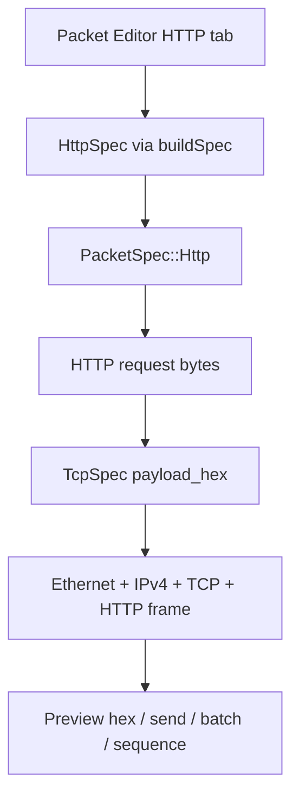

# feat: Add HTTP/1.1 packet builder

## Summary

Add a Layer 7 HTTP/1.1 cleartext packet builder that composes an HTTP request body and sends it as the payload of the existing Ethernet + IPv4 + TCP frame builder. The feature extends the packet editor, templates, generated type contract, and hex scope so users can craft and inspect HTTP request frames without pretending BitSender owns a full TCP session stack.

---

## Problem Frame

BitSender currently models Layer 2 through Layer 4 protocols directly and exposes arbitrary payload hex for higher layers. Users can already craft HTTP bytes by hand, but the editor does not offer HTTP semantics such as method, host, path, headers, and body. Supporting HTTP at Layer 7 improves usability and visual teaching value while preserving the project’s raw-packet identity.

---

## Requirements

**HTTP packet construction**

- R1. Users can select an HTTP protocol tab and configure Ethernet, IPv4, TCP, and HTTP request fields in one form.
- R2. The builder emits a complete Ethernet frame containing IPv4, TCP, and an HTTP/1.1 request payload encoded with CRLF line endings.
- R3. The generated HTTP payload includes request line, Host header, optional user headers, a blank line, and optional body.
- R4. TCP and IPv4 checksums remain automatically calculated by the existing checksum path unless the user overrides the TCP checksum.

**Scope honesty**

- R5. The UI and docs make clear that HTTP support is a packet constructor over TCP payload, not a stateful HTTP client.
- R6. HTTPS and TCP three-way handshake/session automation remain out of scope for this feature.

**Type and UI integration**

- R7. The Rust `PacketSpec` and generated TypeScript bindings include the new HTTP variant so contract drift fails at compile time.
- R8. Templates, i18n labels, and frontend tests cover HTTP defaults and request construction.
- R9. The hex scope highlights HTTP bytes as an application layer distinct from transport payload.

---

## Key Technical Decisions

- **HTTP as a new `PacketSpec` variant:** A first-class `HttpSpec` keeps Layer 7 fields typed and discoverable while reusing the existing TCP frame builder for Ethernet, IPv4, TCP layout, and checksums.
- **HTTP/1.1 cleartext only:** The first implementation targets port 80 style plaintext HTTP. HTTPS requires TLS handshake and encryption state, which would misrepresent this feature if squeezed into a payload builder.
- **No automatic TCP session management:** The feature crafts frames with user-provided `seq`, `ack`, and flags. It does not send SYN, wait for SYN-ACK, or maintain remote sequence state.
- **User headers as newline text:** A multiline header field is the right-sized editor surface. The backend normalizes line endings and rejects malformed header lines that do not contain a colon.
- **Application layer coloring in the scope:** Add a separate application layer boundary for HTTP instead of reusing generic payload coloring so the visual model reaches Layer 7.

---

## High-Level Technical Design

`HttpSpec` owns application fields and TCP/IP addressing fields. `build_http` validates and serializes the HTTP request, hex-encodes the resulting bytes, creates an internal `TcpSpec`, and delegates to `build_tcp`. The resulting frame remains compatible with existing preview, send, batch, and sequence paths because those paths already consume `PacketSpec`.

---

## Scope Boundaries

### In scope

- HTTP/1.1 request payload generation over IPv4/TCP.
- Packet editor protocol tab, i18n field labels, default template, and hex scope Layer 7 coloring.
- Rust golden tests, TypeScript constructor tests, and generated bindings refresh.

### Deferred to Follow-Up Work

- Stateful TCP transaction mode that performs SYN/SYN-ACK/ACK, sends HTTP data, captures response, and closes the session.
- HTTP response parsing in the sniffer.
- HTTPS/TLS record construction or real TLS handshake support.
- IPv6 HTTP over TCP support.

---

## Implementation Units

### U1. Backend HTTP spec and builder

- **Goal:** Add a typed `HttpSpec` and builder that serializes HTTP/1.1 request bytes and delegates frame construction to `build_tcp`.
- **Requirements:** R2, R3, R4, R5, R6.
- **Dependencies:** None.
- **Files:** `src-tauri/src/v2/protocol/http.rs`, `src-tauri/src/v2/protocol/mod.rs`, `src-tauri/src/v2/protocol/tcp.rs`.
- **Approach:** Mirror the `tcp.rs` field surface for Ethernet, IPv4, and TCP fields, then add `method`, `host`, `path`, `headers`, and `body`. Normalize path to start with `/`, trim method and host, serialize with `\r\n`, and feed the ASCII/UTF-8 bytes to the existing TCP builder as hex payload. Keep checksum ownership inside `build_tcp`.
- **Patterns to follow:** Existing protocol modules in `src-tauri/src/v2/protocol/`, especially `tcp.rs` for frame construction and golden tests.
- **Test scenarios:**
  - Build a default GET request and assert the frame contains `GET / HTTP/1.1\r\nHost: example.com\r\n` after the TCP header.
  - Build a POST request with custom headers and body, then assert body bytes appear after the blank CRLF line.
  - Reject an empty method, empty host, or malformed header line without a colon.
  - Verify TCP pseudo-header checksum still self-validates for the HTTP payload.
- **Verification:** Rust tests prove HTTP payload layout, validation, and checksum behavior without relying on live network send.

### U2. Generated contract and frontend protocol constructor

- **Goal:** Expose `kind: "http"` through generated bindings and make the frontend construct the new variant type-safely.
- **Requirements:** R1, R7, R8.
- **Dependencies:** U1.
- **Files:** `src/api/bindings.ts`, `src/lib/protocols.ts`, `src/lib/protocols.test.ts`.
- **Approach:** Add HTTP to `ProtoKey`, `PROTOCOLS`, defaults, field kinds, and `buildSpec`. Introduce a multiline text field kind for headers/body if hex-only textarea behavior is too narrow for application data. Regenerate bindings via the Rust specta export test instead of hand-editing generated output.
- **Patterns to follow:** Existing `tcp` protocol metadata and `buildSpec` tests in `src/lib/protocols.test.ts`.
- **Test scenarios:**
  - `buildSpec("http", defaultValues("http"))` returns a `kind: "http"` object with HTTP fields and inherited TCP/IP defaults.
  - Header/body fields remain strings and are not parsed as hex.
  - Existing protocol constructors still pass for every `PROTOCOLS` entry.
- **Verification:** TypeScript compile and Vitest catch missing fields or contract drift after binding generation.

### U3. Packet editor UI, i18n, templates, and Layer 7 scope coloring

- **Goal:** Make HTTP usable and visually distinct in the editor and template library.
- **Requirements:** R1, R5, R8, R9.
- **Dependencies:** U1, U2.
- **Files:** `src/features/packet-editor/PacketEditor.tsx`, `src/lib/hexdump.ts`, `src/lib/hexdump.test.ts`, `src/lib/i18n.ts`, `src/lib/templates.ts`.
- **Approach:** Render HTTP headers and body as multiline text fields, add an `APP`/Layer 7 group, add an HTTP default template, and update hex scope boundaries so bytes after the TCP header are colored as application data for HTTP. Add concise UI copy or hints that this is raw HTTP payload over TCP, not a full HTTP client.
- **Patterns to follow:** Current grouped field rendering in `PacketEditor.tsx`, default template merge behavior in `src/lib/templates.ts`, and layer boundary tests in `src/lib/hexdump.test.ts`.
- **Test scenarios:**
  - HTTP layer boundaries classify Ethernet, IPv4, TCP, and HTTP bytes separately.
  - Template defaults include an HTTP GET request and merge into existing localStorage data by ID.
  - i18n contains both zh-CN and en-US labels for every new field/group key.
- **Verification:** UI preview can switch to HTTP, edit method/path/headers/body, and show Layer 7 colored bytes in the scope.

### U4. Documentation and full validation

- **Goal:** Update project documentation and run the repo’s normal validation suite for the new protocol.
- **Requirements:** R5, R6, R8, R9.
- **Dependencies:** U1, U2, U3.
- **Files:** `README.md`, `README.zh-CN.md`, `docs/REWRITE_PLAN.md` if the protocol matrix needs a current-state note.
- **Approach:** Add a short mention that HTTP support is Layer 7 packet crafting over TCP payload, with TCP session and HTTPS listed as future work. Keep README launch copy concise.
- **Patterns to follow:** Existing README feature bullets and bilingual wording in `README.zh-CN.md`.
- **Test scenarios:**
  - Documentation does not imply BitSender can complete a live HTTP transaction without a TCP session engine.
  - All existing Rust, TypeScript, and frontend tests pass after binding regeneration.
- **Verification:** `cargo test`, `cargo clippy`, `pnpm typecheck`, and `pnpm test` succeed locally; browser smoke verifies HTTP preview rendering if the dev server is available.

---

## Acceptance Examples

- AE1. Given the HTTP tab defaults, when the preview builds, then the TCP payload decodes to `GET / HTTP/1.1\r\nHost: example.com\r\nConnection: close\r\n\r\n`.
- AE2. Given method `POST`, path `/api`, header `Content-Type: text/plain`, and body `ping`, when the preview builds, then the payload contains the header line, a blank line, and `ping` after the HTTP header section.
- AE3. Given a custom header line `BrokenHeader`, when the preview builds, then the backend returns a validation error instead of silently emitting malformed HTTP.

---

## System-Wide Impact

The change extends the type-safe Rust-to-TypeScript command contract, so generated bindings are part of the implementation rather than an optional artifact. Sequence send, batch send, and template load should work without bespoke code because they already consume `PacketSpec`, but they must be checked after the new union member is added.

---

## Risks & Dependencies

- **User expectation risk:** HTTP sounds like a real client capability. UI and docs must state that this feature constructs HTTP bytes inside a raw TCP frame only.
- **Header serialization risk:** Mixed newline styles and malformed headers can produce surprising bytes. Backend normalization and validation should own this behavior.
- **Contract regeneration risk:** `src/api/bindings.ts` is generated and must be refreshed by `cargo test`; hand edits would violate the project contract.
- **Visual boundary risk:** TCP data offset can vary, but the current scope coloring already uses fixed protocol boundaries. HTTP can follow that approximation unless the implementation adds dynamic boundary metadata later.

---

## Sources & Research

- `src-tauri/src/v2/protocol/tcp.rs` defines the TCP frame builder and checksum behavior to reuse.
- `src-tauri/src/v2/protocol/mod.rs` owns the `PacketSpec` tagged union and dispatch path.
- `src/lib/protocols.ts` is the frontend protocol metadata and type-safe `buildSpec` constructor.
- `src/features/packet-editor/PacketEditor.tsx` renders grouped fields and preview scope.
- `src/lib/hexdump.ts` owns current L2/L3/L4/payload coloring boundaries.
- `src/lib/templates.ts` and `src/lib/i18n.ts` own defaults and bilingual UI labels.
